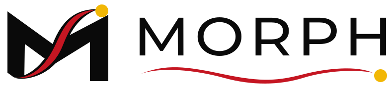
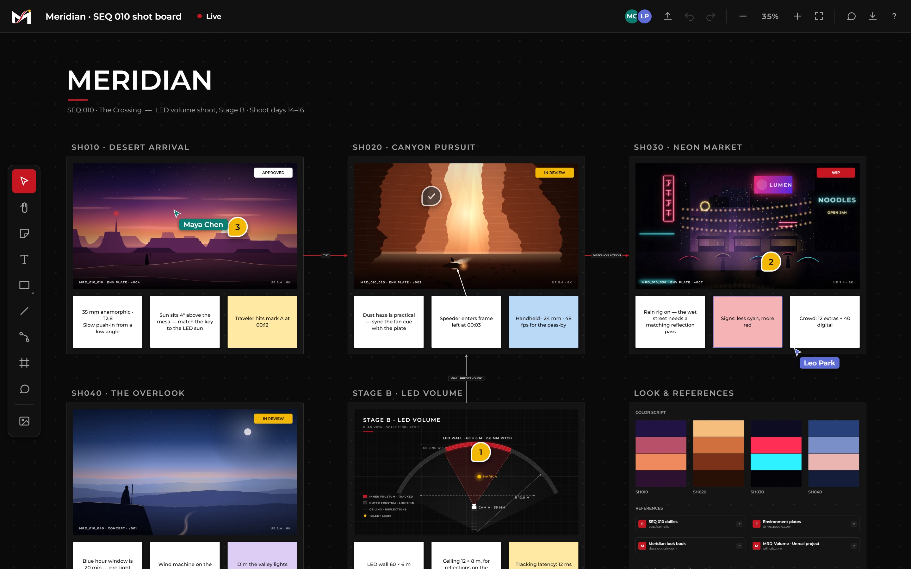
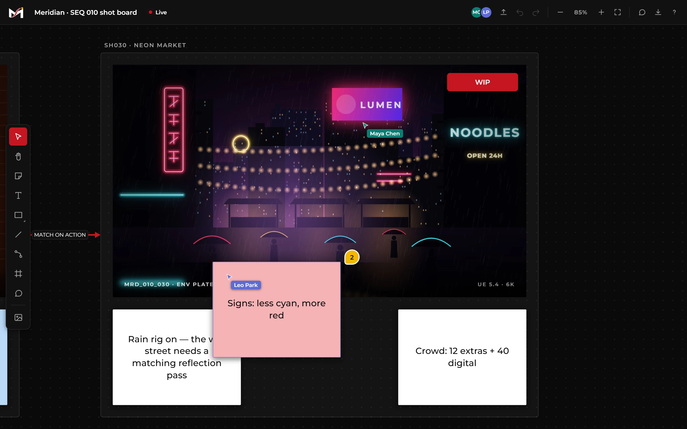
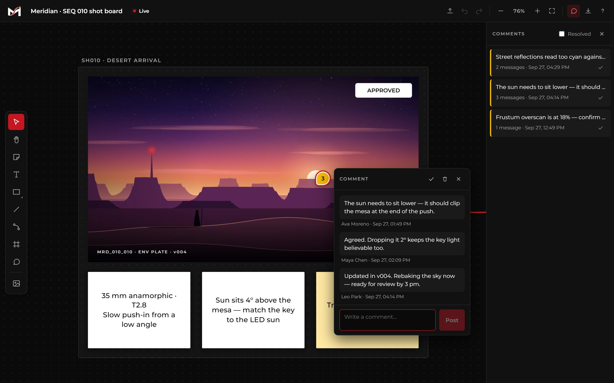
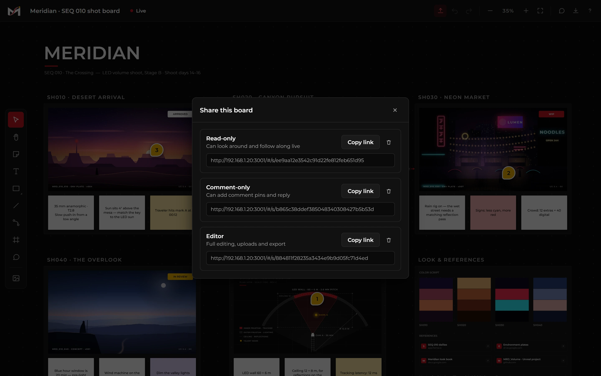
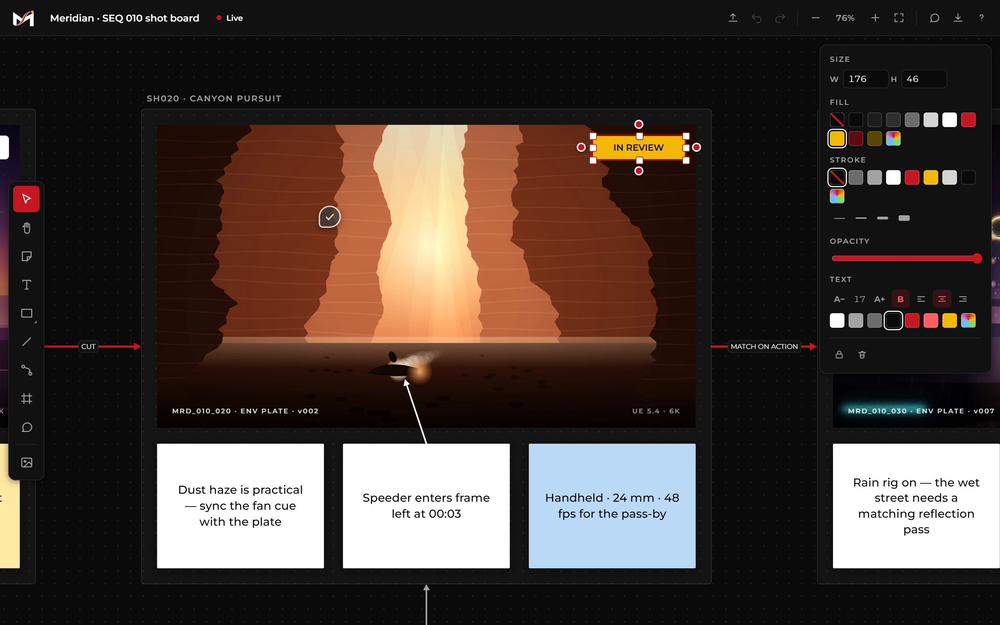
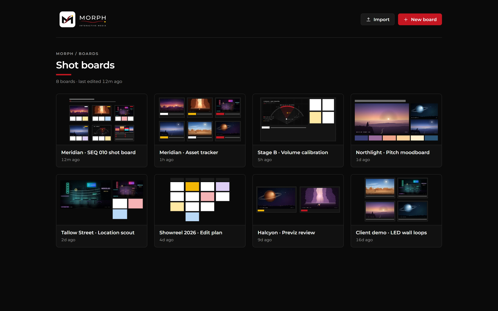
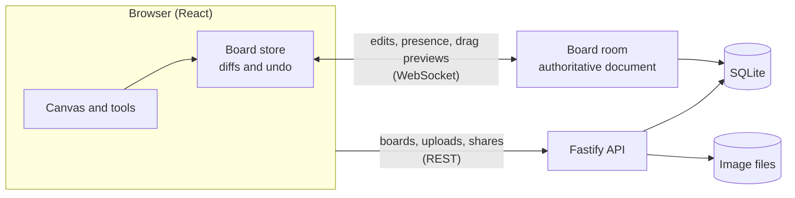

<p align="center">
  <picture>
    <source media="(prefers-color-scheme: dark)" srcset="client/public/brand/morph-dark-event-lockup.svg">
    
  </picture>
</p>

<h1 align="center">MorphBoards</h1>

<p align="center">
  A self-hosted, real-time collaborative canvas for virtual production:<br>
  shot boards, reference plates, review threads and asset tracking, on your own hardware.
</p>

<p align="center">
  
  
  
  
  
  
</p>

<p align="center">
  
</p>

---

MorphBoards is a Miro-style infinite canvas built for the way virtual production teams actually work. Frames are **shots**, and moving or scaling one carries every plate, note and arrow inside it. Comment pins hold **review threads** with authors and a resolve state, and **share links** bring directors, DPs and VAD artists onto the same board live, each with exactly the access they need.

It runs on your own machine or server. Boards live in a single SQLite file and every uploaded image is a real file on disk, so nothing depends on a third-party cloud, and it works offline on a stage network.

## Contents

- [Features](#features)
- [Quick start](#quick-start)
- [Sharing and collaboration](#sharing-and-collaboration)
- [Keyboard shortcuts](#keyboard-shortcuts)
- [Configuration](#configuration)
- [Data and backups](#data-and-backups)
- [Architecture](#architecture)
- [Development](#development)
- [Roadmap](#roadmap)

## Features

<table>
  <tr>
    <td width="50%" valign="top">
      <br>
      <b>Live collaboration</b><br>
      Named cursors, selections and in-progress drags stream to everyone on the board.
    </td>
    <td width="50%" valign="top">
      <br>
      <b>Review threads</b><br>
      Pin feedback to the exact spot on a plate. Threads keep their authors, and resolve when the note is addressed.
    </td>
  </tr>
  <tr>
    <td width="50%" valign="top">
      <br>
      <b>Role-based share links</b><br>
      Separate read-only, comment-only and editor links. Revoke one and its users are disconnected instantly.
    </td>
    <td width="50%" valign="top">
      <br>
      <b>Precise editing</b><br>
      Brand colour presets, a custom colour picker with live preview, exact sizes, and type controls for any element.
    </td>
  </tr>
</table>

**Canvas**
- Smooth pan and zoom (2%–400%) on an infinite dot-grid canvas
- Shapes, text, sticky notes, lines and arrows, with inline editing
- Images by drag and drop, paste, or file picker. Copy an image from the board straight into other apps
- Link cards for dailies, drives and docs

**Shot structure**
- Frames that move their contents together; corner handles scale the whole shot, text included
- Connectors that attach to elements and follow them, with straight or elbow routing and labels
- Shot titles and comment pins that stay legible at any zoom level

**Review and collaboration**
- Comment pins with threaded, authored messages, a resolve state and a comments sidebar
- Real-time multi-user editing, with presence, live cursors and selection outlines
- Guests pick a display name once; their browser remembers it, so their comments stay theirs

**Everyday essentials**
- Undo and redo, copy and paste (including between boards), and a full keyboard map
- Autosave, a board manager with live thumbnails, and zip export and import for backups

<p align="center">
  
</p>

## Quick start

You need **Node.js 20 or later**.

```bash
git clone <your-repo-url> morphboards
cd morphboards
npm install
```

**Everyday use.** Build once and serve everything from a single port:

```bash
npm start
```

Then open <http://127.0.0.1:3001>. On Windows you can double-click **`MorphBoards.cmd`** instead: it installs, builds and opens the browser on first run.

**Development.** Run the API and the Vite dev client with hot reload:

```bash
npm run dev
```

The client runs on <http://localhost:5173> and proxies API and WebSocket calls to the server on port 3001.

## Sharing and collaboration

Open a board and click the share button in the top bar. Create a link for each role you need:

| | Read-only | Comment-only | Editor | Owner |
|---|:---:|:---:|:---:|:---:|
| View the board and follow along live | ✓ | ✓ | ✓ | ✓ |
| Add, reply to and resolve comments | | ✓ | ✓ | ✓ |
| Edit content, upload images, export | | | ✓ | ✓ |
| Rename or delete the board, manage links | | | | ✓ |

Anyone who opens a link joins the board live. Changes, cursors and selections sync in real time, and if the connection drops, clients reconnect and resync automatically.

**Reaching other devices.** By default the server listens only on the machine it runs on. To let people on your network open share links, bind it to all interfaces:

```bash
MORPH_HOST=0.0.0.0 npm start
```

On Windows PowerShell, use `$env:MORPH_HOST='0.0.0.0'; npm start`. The share dialog then builds links with your LAN address.

**How access works**
- Share links are unguessable 128-bit tokens.
- Every API route and every live edit is checked against the link's role on the server. Hiding tools in the UI is a convenience, not the security boundary.
- Revoking a link disconnects anyone using it immediately.
- The machine running the server is the board owner.

## Keyboard shortcuts

| Tools | | Editing | | View | |
|---|---|---|---|---|---|
| Select | `V` | Undo / redo | `Ctrl+Z` / `Ctrl+Y` | Zoom at cursor | `Ctrl` + wheel |
| Pan | `H` | Copy / paste | `Ctrl+C` / `Ctrl+V` | Pan | wheel or `Space` + drag |
| Sticky note | `N` | Duplicate | `Ctrl+D` or `Alt` + drag | Zoom in / out | `Ctrl+=` / `Ctrl+-` |
| Text | `T` | Delete | `Delete` | Actual size | `Ctrl+0` |
| Shape | `S` | Nudge | arrow keys (`Shift` for 10 px) | Fit board | `Shift+1` |
| Line / connector | `L` / `C` | Layer order | `Ctrl+[` / `Ctrl+]` | Fit selection | `Shift+2` |
| Frame / comment | `F` / `M` | Select all | `Ctrl+A` | All shortcuts | `?` |

## Configuration

The server reads these environment variables:

| Variable | Default | Purpose |
|---|---|---|
| `MORPH_PORT` | `3001` | HTTP and WebSocket port |
| `MORPH_HOST` | `127.0.0.1` | Interface to bind. Use `0.0.0.0` to accept connections from other devices |
| `MORPH_DATA_DIR` | `server/data` | Where the database, uploads and thumbnails live |
| `MORPH_TRUST_PROXY` | unset | Set to `1` when running behind a reverse proxy, so client IPs are read correctly |

## Data and backups

Everything lives in one folder, `server/data/` by default:

| Path | Contents |
|---|---|
| `morphboards.db` | SQLite database: one row per board, plus share links |
| `assets/<boardId>/` | Uploaded images, as ordinary files |
| `thumbnails/` | Board previews for the board manager |
| `crash.log` | Stack traces from any fatal server error |

To back up **one board**, use the export button: you get a `.zip` with the board and all its images, which **Import** restores on any MorphBoards instance. To back up **everything**, copy `server/data/`.

## Architecture



- **Monorepo.** npm workspaces: `client/` (React 18, Vite, Zustand, and a custom canvas engine), `server/` (Fastify 5, better-sqlite3, WebSocket rooms) and `shared/` (the board schema and sync protocol).
- **One model for undo and sync.** Every change is a before/after diff. Locally, those diffs drive undo and redo. Over the wire, the same diffs are the sync protocol: the server applies each one last-write-wins per element, persists it, and broadcasts it. Undo sends the inverse diff.
- **Server-enforced roles.** Each incoming operation is filtered by the sender's role. A comment-only link can touch comment pins and nothing else.

## Development

| Command | What it does |
|---|---|
| `npm run dev` | API server and hot-reloading client |
| `npm test` | Unit tests (Vitest): geometry, undo history, the sync protocol and role checks |
| `npm run typecheck` | Strict TypeScript across client and server |
| `npm run build` | Production build of the client |
| `npm run screenshots` | Regenerates the images in `docs/screenshots/` |

```
client/src/
  canvas/        rendering: world layer, connectors, overlay, presence
  interactions/  pointer, keyboard and clipboard behaviour
  state/         board, UI, session and presence stores
  components/    panels, dialogs, toolbar and top bar
server/src/      REST routes, auth and roles, realtime rooms, SQLite
shared/src/      board types and the sync protocol
scripts/screenshots/  demo boards and the screenshot capture
```

**Screenshots.** `npm run screenshots` needs Node.js 22+ and Chrome or Edge. It starts a throwaway server with its own data folder, seeds *Meridian*, a fictional VP production with procedurally painted plates. It then drives a headless browser, including two guest sessions for the live-collaboration shots. Your real boards are never touched. Set `CHROME_PATH` to use a specific browser.

## Roadmap

- **Google sign-in.** Accounts for people who want them. Guests will keep working with display names.
- **Hosted deployment.** A hardening pass plus a guide for running MorphBoards on a server behind HTTPS.
- **Virtual production tools.** A shot-list panel built from frames, asset status tracking, shot-sheet PNG export, CSV asset export, alignment guides, a minimap, and video reference clips.

## Brand

MorphBoards uses the Morph Brand System V2. The logos in `client/public/brand/` are the official artwork, used as supplied. Please don't modify them or reuse them outside this project.
